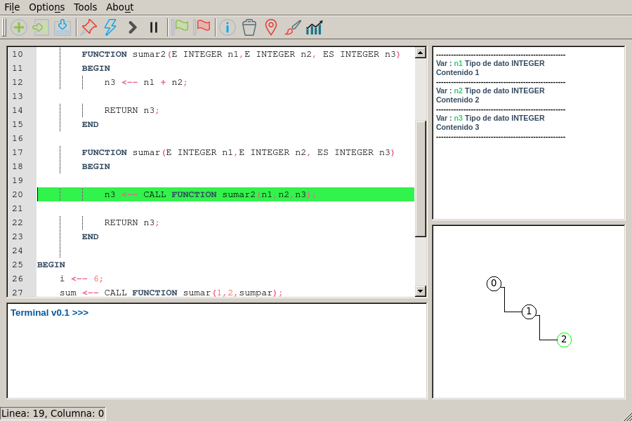
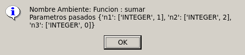
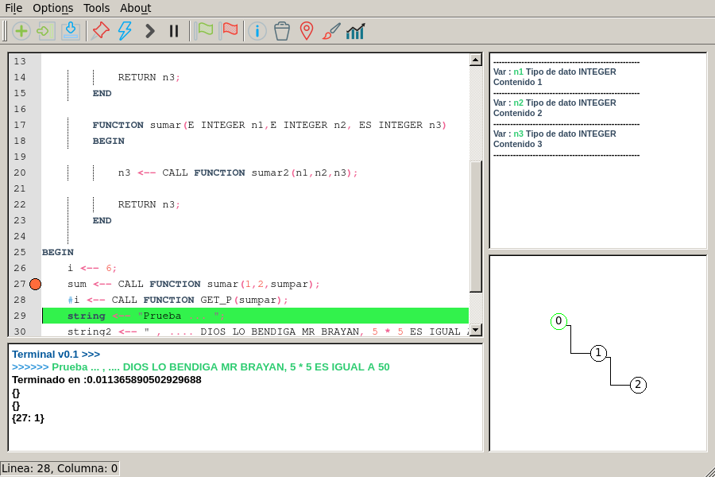
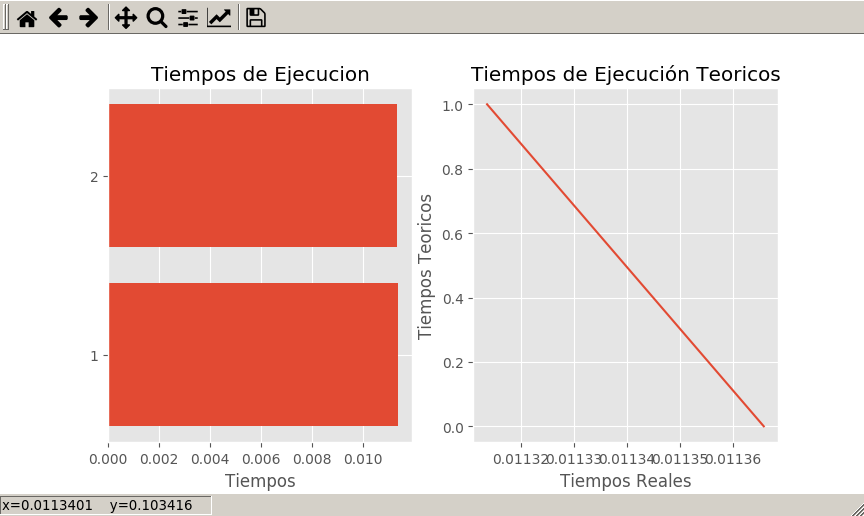

### Proyecto de Análisis y Diseño de Algoritmos 2016-2

El Objetivo del proyecto propuesto fue desarrollar una herramienta que facilite al usuario el análisis de los algoritmos iterativos. Dicho proyecto debe cumplir con los siguientes requisitos principales:

- Poseer un editor que permita la escritura de algoritmos iterativos.
- Permitir al usuario seguir el algoritmo paso a paso y visualizar el estado de las variables.
- Permitir al usuario Observar el árbol de ejecución generado.
- Establecer breakpoints (que tiene como función contar las veces que se pasa por la línea marcada) esto para tener un acercamiento de la complejidad del algoritmo digitado.

Para satisfacer los requisitos planteados se decidió utilizar como lenguaje de programación Python haciendo uso de las siguientes librerías:

- PLY (Python  Lex-Yacc) http://www.dabeaz.com/ply/ 
    pip3 install ply
- PyQt4 https://www.riverbankcomputing.com/software/pyqt/download
    pip3 install PyQt5
- Qscintilla https://riverbankcomputing.com/software/qscintilla/intro
    pip3 install QScintilla
- Matplotlib http://matplotlib.org 
    pip3 install matplotlib
- NetworkX https://networkx.github.io/ 
    pip3 install networkx

### Preview

Editor de código

Mensaje al dar click sobre algú nodo(ambiente) del árbol.

Breakpoints en el editor.

Gráfica de tiempos de ejecución

